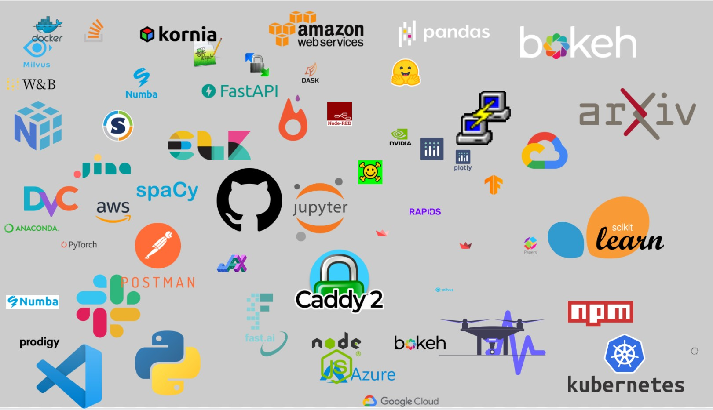

# Icons Icons Icons
### Icons/Logos of ML & Development related things

Do you have a folder full of icons?
Logos of companies, libraries, languages... 

Tired of doing google image search ever time you have to prepare a presentation?

Googling 'blahblah logo png', 'blahblah logo transparent' only to end up being click baited 🤦

Tired of having to convert between formats `.ico` `.svg` `.png` `.jpeg` ?

Do you prepare informative presentations explain pipelines & technologies a lot?

Then this repo is for you! (Well actually it is for me, but I'm making it public because I think it is useful)

Git may not be the best place to store these but whatever :shrug: 

I will keep adding stuff as I find them randomly scattered on my drive :sweat_smile:

This is not a completely comprehensive list! This is just stuff I have accumulated over time. Here they are randomly scattered on a slide:

# Collection Method

They are usually copied from related official websites & converted from various formats to PNG (can't use svg with in google slides)
They vary in scale, so resize as needed.

Some companies have multiple versions of their icons light/dark, icon w/o name etc, some don't. Up to you to crop as needed.

# FYI
I don't own any of these logos, they belong to whoever owns them.

Follow fair non-commercial use,
aka don't sue me. If you don't want your icon/logo here open an issue and I will remove.

If you want your icon here open a PR~

# Links 
Icon/Logo Sources:
- https://www.vectorlogo.zone/

Tools:
 - Simple background removal : https://www.remove.bg/
 - File format convertions: https://cloudconvert.com/

Let me know if you have recommendations 😉